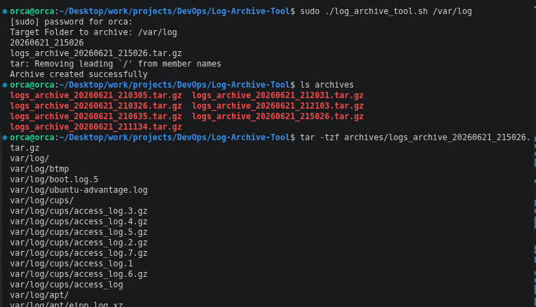

# Log Archive Tool

A simple Bash-based CLI tool that archives log directories by compressing them into timestamped `.tar.gz` files.

This project was built to practice Linux administration, shell scripting, file handling, compression, and basic DevOps automation concepts.

---

## Features

* Accepts a log directory as a command-line argument
* Validates user input
* Checks if the target directory exists
* Generates timestamped archive names
* Compresses logs into `.tar.gz` format
* Stores archives in a dedicated `archives/` directory
* Reports success or failure using command exit codes
* Maintains an archive history log

---

## Project Structure

```text
Log-Archive-Tool/
│
├── archives/
│   ├── logs_archive_20260621_210305.tar.gz
│   ├── logs_archive_20260621_212103.tar.gz
│   └── ...
│
├── archive_history.log
├── log_archive_tool.sh
├── README.md
└── terminal_output.png
```

---

## Usage

Make the script executable:

```bash
chmod +x log_archive_tool.sh
```

Run the tool:

```bash
./log_archive_tool.sh <log-directory>
```

Example:

```bash
./log_archive_tool.sh test_logs
```

Archive a system log directory:

```bash
sudo ./log_archive_tool.sh /var/log
```

---

## Example Output

```text
Target Folder to archive: test_logs
20260621_212103
logs_archive_20260621_212103.tar.gz
Archive created successfully
```

---

## Verify Archive Contents

List files inside an archive without extracting it:

```bash
tar -tzf archives/logs_archive_20260621_212103.tar.gz
```

Example output:

```text
test_logs/
test_logs/error.log
test_logs/app.log
```

---

## Screenshot



---

## Concepts Practiced

### Linux Administration

* Working with system log directories
* File permissions
* Directory management

### Shell Scripting

* Variables
* Conditional statements
* Exit codes
* Command-line arguments

### DevOps Fundamentals

* Log management
* Backup automation
* Compression and archiving
* Error handling
* Automation scripting

---

## Future Improvements

* Schedule automatic archiving using Cron
* Configure archive retention policies
* Upload archives to AWS S3
* Email archive reports
* Add configurable archive destinations
* Support multiple log directories

---


